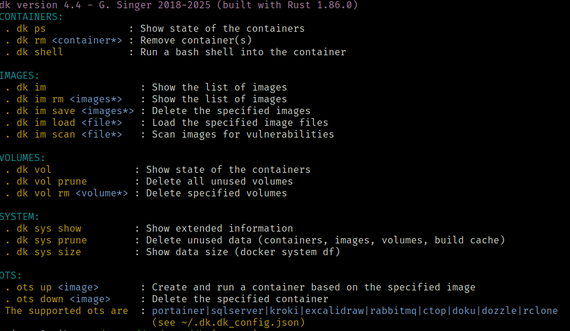

This is a prsonal project to help me to learn rust.

Tthis is a porting from a old script tool I wrote in pwshell then in bash.

This is an tool that allows to handle Docker images, containers, volumes efficiently 

